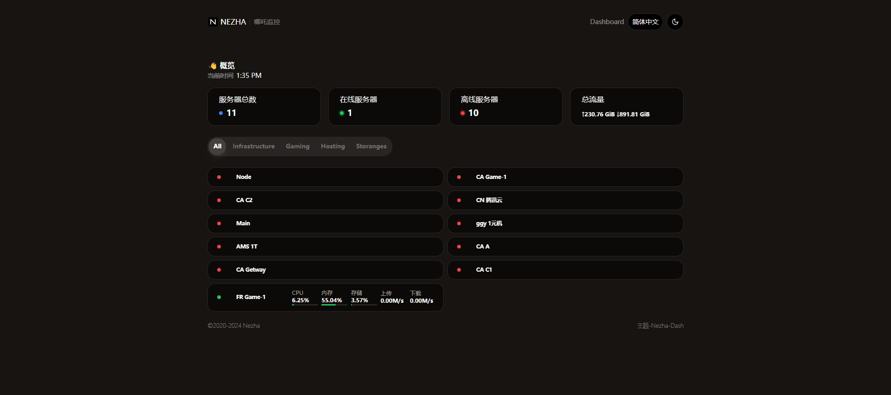
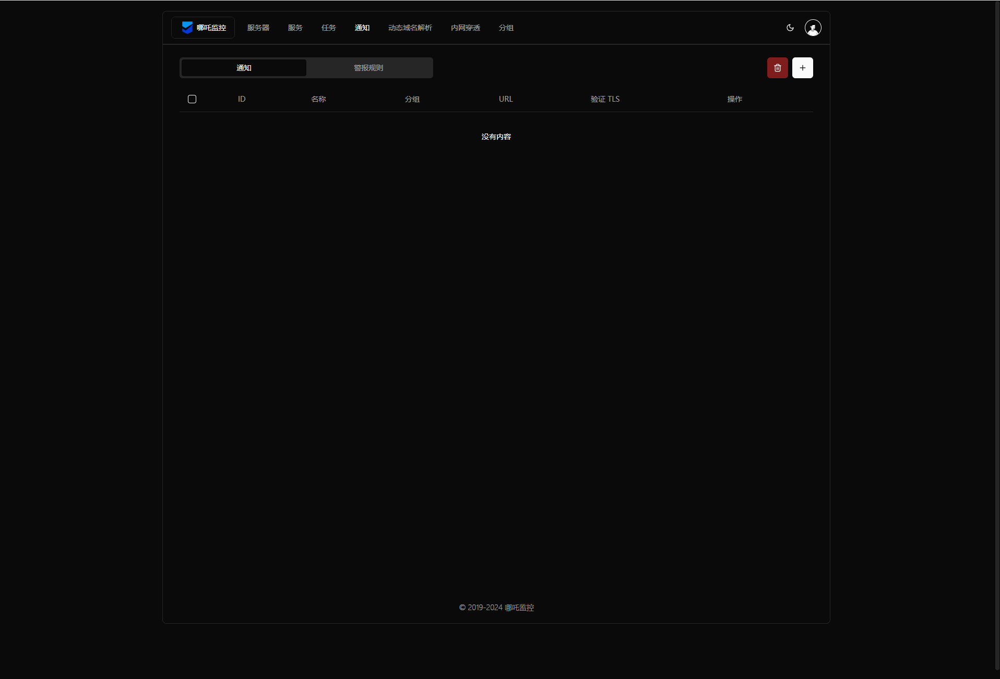

   
  
   
  <small><i>LOGO designed by <a href="https://xio.ng" target="_blank">熊大</a> .</i></small>
    
&nbsp;&nbsp;&nbsp;
   
   
  
:trollface: <b>Nezha Monitoring: Self-hostable, lightweight, servers and websites monitoring and O&M tool.</b>

  
Supports <b>monitoring</b> system status, HTTP (SSL certificate change, upcoming expiration, expired), TCP, Ping and supports <b>push alerts</b>, run scheduled tasks and <b>web terminal</b>.

\>> Telegram Channel: [哪吒监控（中文通知频道）](https://t.me/nezhanews)

\>> Telegram Group: [Nezha Monitoring Global (English Only)](https://t.me/nezhamonitoring_global), [哪吒监控（中文群组）](https://t.me/nezhamonitoring)

\>> [Use Cases | 我们的用户](https://www.google.com/search?q=%22powered+by+Nezha+Monitoring%22+OR+%22powered+by+%E5%93%AA%E5%90%92%E7%9B%91%E6%8E%A7%22) (Google)  

## User Guide

- [English](https://nezhahq.github.io/en_US/index.html)
- [中文文档](https://nezhahq.github.io/index.html)

## Contributing

### Translation

Is Nezha not in your language, or the translation is incorrect or incomplete? Get involved in the translations on [Hosted Weblate](https://hosted.weblate.org/engage/nezha/).

## Screenshots

| 用户前台 [@hamster1963](https://github.com/hamster1963) | 管理后台 [@uubulb](https://github.com/uubulb) |
|---|---|
|   |   |
| [hamster1963/nezha-dash](https://github.com/hamster1963/nezha-dash)  | [nezhahq/admin-frontend](https://github.com/nezhahq/admin-frontend)  |

add your theme to [service/singleton/frontend-templates.yaml](service/singleton/frontend-templates.yaml)

## Contributors

<!--GAMFC_DELIMITER-->

<!--GAMFC_DELIMITER_END-->

## Special Thanks
- [IPInfo](https://ipinfo.io/) for providing an accurate GeoIP Database.

## Star History

